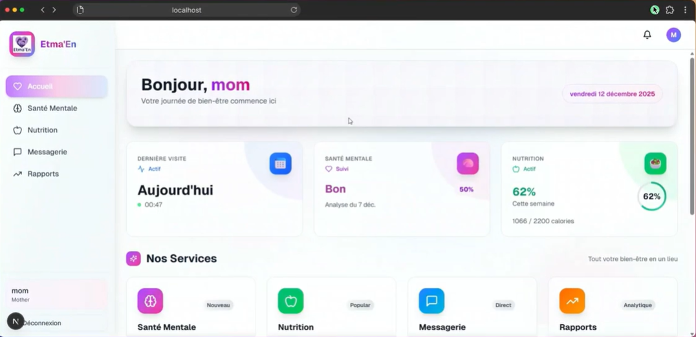

# Etma’en – AI-Powered Family Health Platform

<!-- ================================================= -->
<!--  MAIN PROJECT IMAGE / BANNER                      -->
<!-- ================================================= -->
<!-- Insert a project banner or logo here -->
<!-- Example:  -->

---

## 1. Project Overview

**Etma’en** is a professional, AI-driven web platform dedicated to improving **mental, emotional, and nutritional well-being** for **children, mothers, and healthcare experts**.  
The solution focuses on prevention, monitoring, and intelligent assistance through advanced artificial intelligence and secure web technologies.

Etma’en combines **computer vision**, **natural language processing**, and **real-time communication** to enable early detection of health risks and to support informed decision-making for families and professionals.

---

## 2. Application Preview


### Mother Dashboard


### Child Dashboard


---

## 3. System Architecture Overview

Etma’en is built on a **microservices-based architecture**, ensuring scalability, modularity, and maintainability.

### Frontend
- Next.js 16 (React 19)
- TypeScript
- TailwindCSS
- Radix UI

### Backend Services
- FastAPI (authentication, routing, ML services)
- Flask (AI chatbots, RAG pipelines)
- Node.js with Socket.IO (real-time messaging)

### Database & Storage
- MongoDB Atlas (users, health data, messages, reports)
- Cloudinary (image storage for drawings and meals)

---

## 4. Artificial Intelligence & Data Processing

### Mental and Emotional Health
- Drawing analysis using:
  - Vision Transformer (ViT) for emotion classification
  - DETR for object detection
  - BLIP-2 for image captioning
- Medical chatbot based on Retrieval-Augmented Generation (RAG):
  - HuggingFace embeddings
  - FAISS vector database
  - LLaMA 3.1 via Groq API

### Nutrition Analysis
- Food detection using YOLO
- Food classification using CNN (EfficientNetB0 – Food-101 dataset)
- Calorie and macronutrient estimation using pandas
- Nutrition chatbot trained on structured nutrition datasets

### Cognitive & Behavioral Analysis
- Cognitive performance evaluation (memory, attention, logic)
- Longitudinal trend analysis
- Automated PDF reports and interactive dashboards

---

## 5. Core Functionalities by User Role

### Mother
- Child mental health analysis (drawings and chatbot)
- Nutrition monitoring and meal image analysis
- Historical dashboards and PDF reports
- Secure real-time messaging with experts

### Child / Teen
- Emotion tracking (drawings, journal entries)
- Cognitive games and performance evaluation
- Nutrition awareness and meal scanning
- Breathing exercises and educational content

### Healthcare Expert
- Patient dashboards and longitudinal analytics
- Access to AI-generated reports
- Secure real-time messaging
- Monitoring of mental, nutritional, and cognitive indicators

---

## 6. Technologies Used

### Frontend
- Next.js 16
- React 19
- TypeScript
- TailwindCSS
- Radix UI
- Recharts

### Backend
- FastAPI
- Flask
- Uvicorn
- Node.js
- Socket.IO

### Artificial Intelligence & Data Science
- TensorFlow / Keras
- Vision Transformer (ViT)
- YOLO
- DETR
- BLIP-2
- EfficientNetB0
- HuggingFace Transformers
- FAISS
- LLaMA 3.1 (Groq API)
- pandas, NumPy, OpenCV

### Database & Security
- MongoDB Atlas
- Mongoose
- JWT Authentication
- bcryptjs

### DevOps & Tooling
- Git & GitHub
- Python Virtual Environments
- npm

---

## 7. Installation & Execution

### Prerequisites
- Python 3.10 (required for TensorFlow compatibility)
- Node.js 18+
- MongoDB Atlas account

---

### Clone the Repository
```bash
git clone https://github.com/kard4318/Projet_Web_Objectif3
cd embs/v0-mother-health-app-main
---
###Backend Setup
python -m venv .venv
.venv\Scripts\Activate.ps1   # Windows
# source .venv/bin/activate   # Linux / macOS

python -m pip install --upgrade pip
pip install -r backend/requirments/requirements.txt
pip install -r backend/requirments/requirements-base.txt
pip install -r backend/requirments/requirements-langchain.txt
pip install -r backend/requirments/requirements-ml.txt
pip install -r backend/emotional_classification/model/requirements-LAPTOP-ROJQ4EUE.txt
---
###Frontend Setup
npm install
Backend (all services):

python backend/launcher.py
# Select option 5: Start ALL services
###Frontend:

npm run dev
